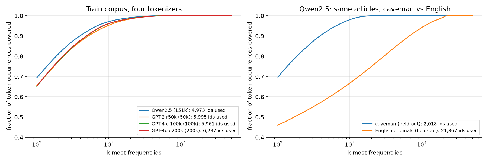
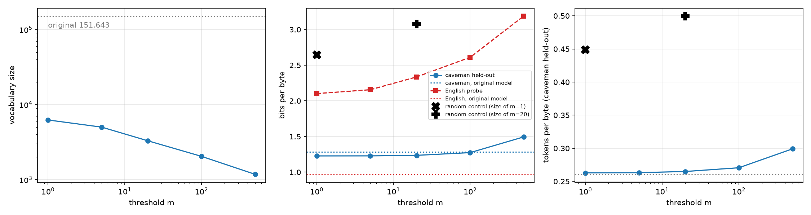

# prune-to-caveman

**Tokenizer and embedding pruning of `Qwen/Qwen2.5-0.5B` for _caveman English_** — Homework 1 of *Modern Methods and
Algorithms of Generative AI* (Skoltech, Fall 2026), Ilia Mikhalchuk.

> *mammoth be big animal with long hair. people hunt it with spear long ago.*

The model's 151,643-token vocabulary is cut to **6,244 tokens** (−26.4% parameters, checkpoint
1000 → 727 MB) without changing a single token of the train corpus' tokenization, and held-out bits per byte goes
1.2846 → 1.2279.

[](https://colab.research.google.com/github/miilv/prune-to-caveman/blob/main/hw1_mikhalchuk.ipynb)
· **Report:** [`report/hw1_mikhalchuk_report.pdf`](report/hw1_mikhalchuk_report.pdf)
· **Pruned model:** [GitHub release `v1.0`](https://github.com/miilv/prune-to-caveman/releases/tag/v1.0) (`tokenizer.json`, `config.json`, `model.safetensors`)

## The language

*Caveman English* is a closed-vocabulary register of English: lowercase base forms from **961 words** (Basic English 850 +
111 caveman words such as *mammoth, spear, tribe, hunt*, minus *a* / *the*), no inflections, ~140 frequent proper names
kept Capitalized (plus the names in the article's own title), digits and `. , ? !`. The corpus is English Wikipedia
(history, nature, places, science, myth, crafts; CC BY-SA 4.0) rewritten by `claude-haiku-5-5` and checked word by word.

| English Wikipedia | caveman English (this corpus) |
|---|---|
| *Elephantomyia brevipalpa is an extinct species of crane fly in the family Limoniidae. The species is solely known from the Middle Eocene Baltic amber deposits in the Baltic Sea region of Europe.* | *this one Elephantomyia be dead kind of long leg fly, from long ago. people know it only from clear tree stone. this stone come from land near sea, in Europe.* |
| *Amphiprion latezonatus, also known as the wide-band anemonefish, is a species of anemonefish found in subtropical waters off the east coast of Australia.* | *Amphiprion, also name wide band fish, be kind of sea flower fish. it live in sea water off east edge of Australia.* |

Train: **2,003 articles, 9.2 MB**; held-out: **182 other articles, 793 KB**
(split by article before generation), plus the English originals of the held-out articles as an out-of-language probe.

## Results

| | original | pruned, m = 1 |
|---|---|---|
| vocabulary / merges | 151,643 / 151,387 | 6,244 / 5,988 |
| parameters | 494.0 M | 363.5 M (−26.4%) |
| bf16 checkpoint | 1000 MB | 727 MB |
| train corpus tokenized identically | – | 100% of articles |
| held-out bits per byte | 1.2846 | 1.2279 |
| English probe bits per byte | 0.970 | 2.102 |

Qwen2.5 uses **4,973 of 151,643 ids (3.28%)** on the train corpus; 1,918 ids cover 99% of all occurrences.

| run | vocab | params | held-out identical | length ratio | bits/byte | English bits/byte |
|---|---|---|---|---|---|---|
| original | 151,643 | 494.0 M | 100.0% | 1.0000 | 1.2846 | 0.970 |
| m=1 | 6,244 | 363.5 M | 40.7% | 1.0106 | 1.2279 | 2.102 |
| m=5 | 5,012 | 362.4 M | 29.1% | 1.0134 | 1.2287 | 2.156 |
| m=20 | 3,296 | 360.9 M | 6.6% | 1.0207 | 1.2358 | 2.335 |
| m=100 | 2,045 | 359.8 M | 1.1% | 1.0423 | 1.2742 | 2.611 |
| m=500 | 1,178 | 359.0 M | 0.0% | 1.1488 | 1.4949 | 3.190 |
| random, size of m=1 | 6,244 | 363.5 M | 0.0% | 1.7211 | 2.6450 | 2.844 |
| random, size of m=20 | 3,296 | 360.9 M | 0.0% | 1.9164 | 3.0777 | 3.381 |




* **Why bits per byte improves:** the pruned softmax renormalises over the kept tokens, so every kept target gets
  $p/\sum_{kept} p \ge p$ — a prior from corpus statistics, not a better model; on ordinary English it gets much worse.
* **Random control:** the same number of random tokens (with merge closure) makes caveman text 1.72× longer and
  2.645 bits/byte — the gain comes from the skewed usage distribution.
* **What to ship:** m = 1. After the first cut the embedding is 1.6% of the model; larger thresholds save at most 1.3% more and lose robustness.
* **Bonuses:** B1 vocabulary extension (little to gain: every list word is already one token), B3 tokenizer trained from
  scratch (random embeddings → 4.719 bits/byte; mean-of-pieces init → 1.232), B4 serving (peak memory 1002 → 747 MiB).

## Repository

```
hw1_mikhalchuk.ipynb        the homework notebook, executed (Parts 1–4, bonuses B1, B3, B4)
report/                     2-page report (PDF) + its Typst source and generator
corpus/                     frozen caveman corpus: train / held-out / English originals of held-out + metadata
corpus_pipeline/            how the corpus was built (Wikipedia → topic filter → split → Haiku rewrite → checks)
results/                    results.json written by the notebook, corpus generation statistics
figures/                    figures written by the notebook
tools/                      the notebook's source as a `# %%` script and the script → .ipynb converter
```

## Reproduce

Open the notebook in Colab with a GPU runtime (or any machine with a CUDA GPU) and *Run all*. It downloads the frozen
corpus from this repository and the model from the Hugging Face Hub, needs no API keys, and takes
1.6 min on an RTX 4090 (bf16; on a T4 it uses fp16, which gives the same bits per byte to 4 decimals).
Library versions, seed and per-part timings are printed by the notebook and listed in the report.

The corpus itself was built once with `corpus_pipeline/` (≈47 M output tokens of `claude-haiku-5-5`);
the notebook never calls an LLM API.

## Licence and AI assistance

Code: MIT. Corpus: CC BY-SA 4.0 (derived from English Wikipedia). Pruned model: derived from Qwen2.5-0.5B (Apache-2.0).
The notebook, pipeline and report were written with an AI coding assistant (Claude Code, Claude Opus 5.5) under the author's direction.
